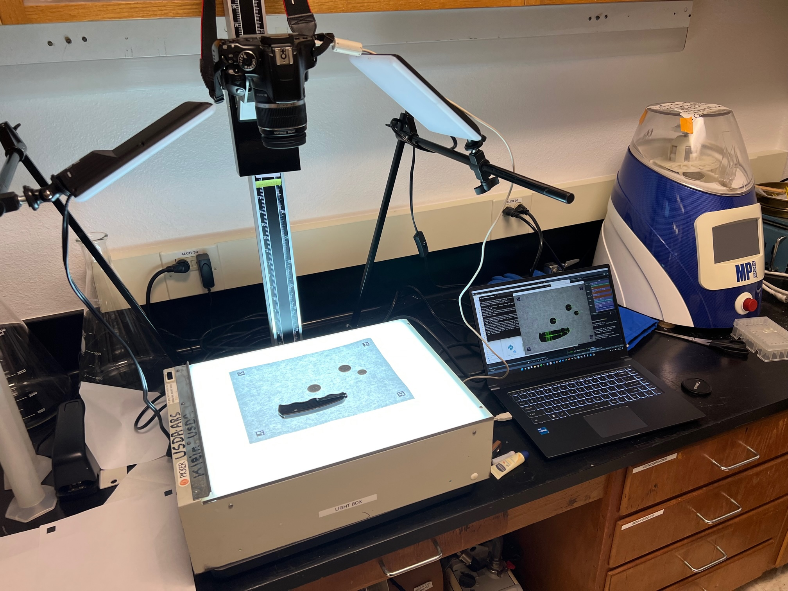
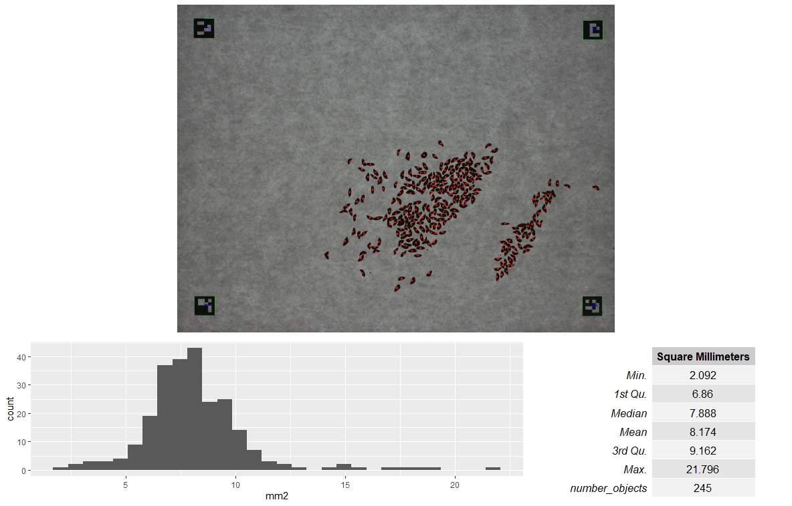
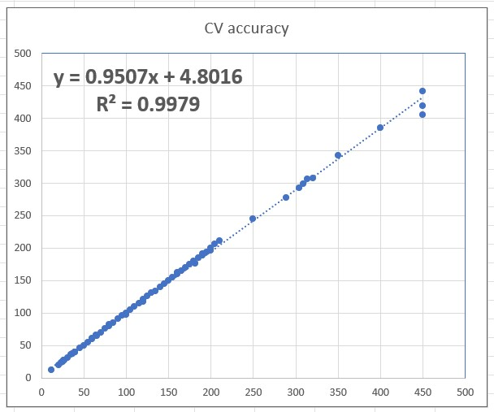
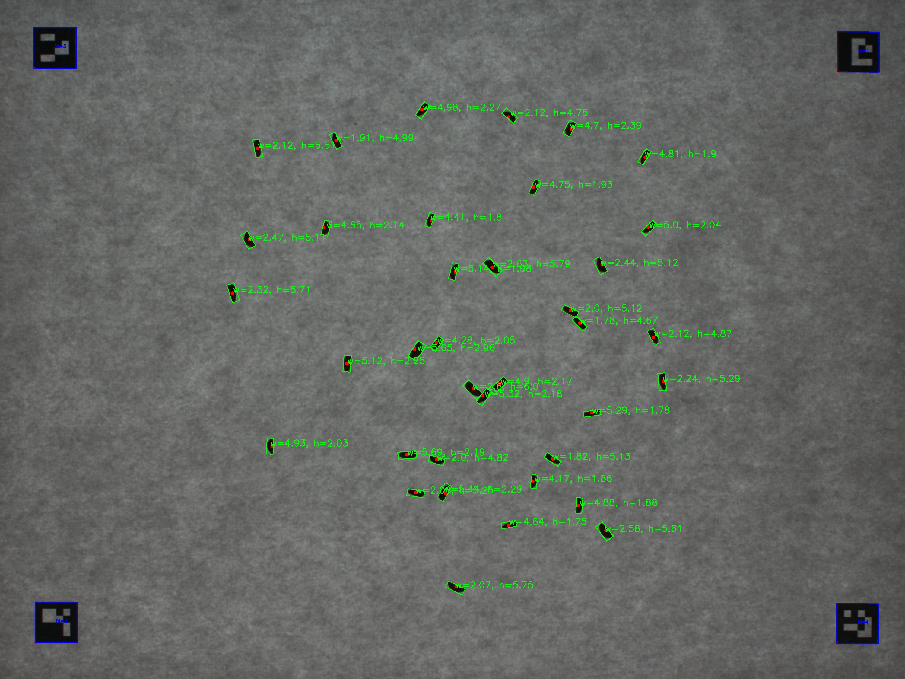

# seed_counter_pipeline_opencv
This is a collection of open source scripts and tools for using a camera to detect number of seeds on a sheet of paper. The tool uses a watershedding algorithm as to try to count seeds that are touching. 


If you use this pipeline or parts of this pipeline, please cite this repository: https://github.com/jeekinlau/seed_counter_pipeline_opencv 

## The setup
A camera mounted on top of a platform such that a 90 degree down angle (dont worry if it is perfect 90 degrees a four-point transformation fixes any deviations)





# Dependencies
- Windows operating system
- digiCamControl (open source digital DSLR controlling software) [link to website](https://digicamcontrol.com/)
- R with dependencies (ggplot2, ggpubr, knitr, gridExtra, magick)
```
# install with these following line
install. packages(c("ggplot2", "ggpubr,"knitr","gridExtra","magick"))
```
- python with dependencies (imutils, skimage, cv2, numpy, scipy)
```
# install with the following line
pip install imutils skimage opencv scikit-image opencv-python numpy scipy
```

## The pipeline
- clone the repository
- open the seed_counter_pipeline folder
- double click the take_photo_count.bat

Details: the script will then connect to your DSLR, snap a photo, detect the 4 corners of the letter paper, then perform a four point transformation to correct from any deviation from 90 overhead and crop the photo. The script will then detect the new cropped photo, detect the aruco markers, get an average pixels per area of the 4 aruco markers, mask the aruco markers then count the objects. The resulting output will give you a R generated report looking like the below picture.



The generated report will give you a good idea if anything went wrong. Objects counted are denoted with a red dot. sometimes you will see one red dot and two objects, that is because the watershed algorithm was not able to differentiate the two.

The accuracy from real world counted to actual is quite high at R-squared higher than 0.99



## Instructions on aruco markers
The aruco.docx has the aruco markers in the four corners. After printing, make sure the edges of the markers is exactly half a inch by half inch. The script is currently written in such a way that the physical world reference size of these aruco markers is hard-coded as half an inch. 


## pipeline including length and width
This pipeline does everthing above and plus it counts the length and width of everything detected in picture. The output is pictures and a csv that contains area, length and width. (Caveat: do not use this with banana shaped objects as the function fits the best rectangle around each contour).



## Other pipelines (easily implemented pipelines for future or pending)
 - remove 4 point transform to speed up counts
 - no aruco markers
 - add length and width