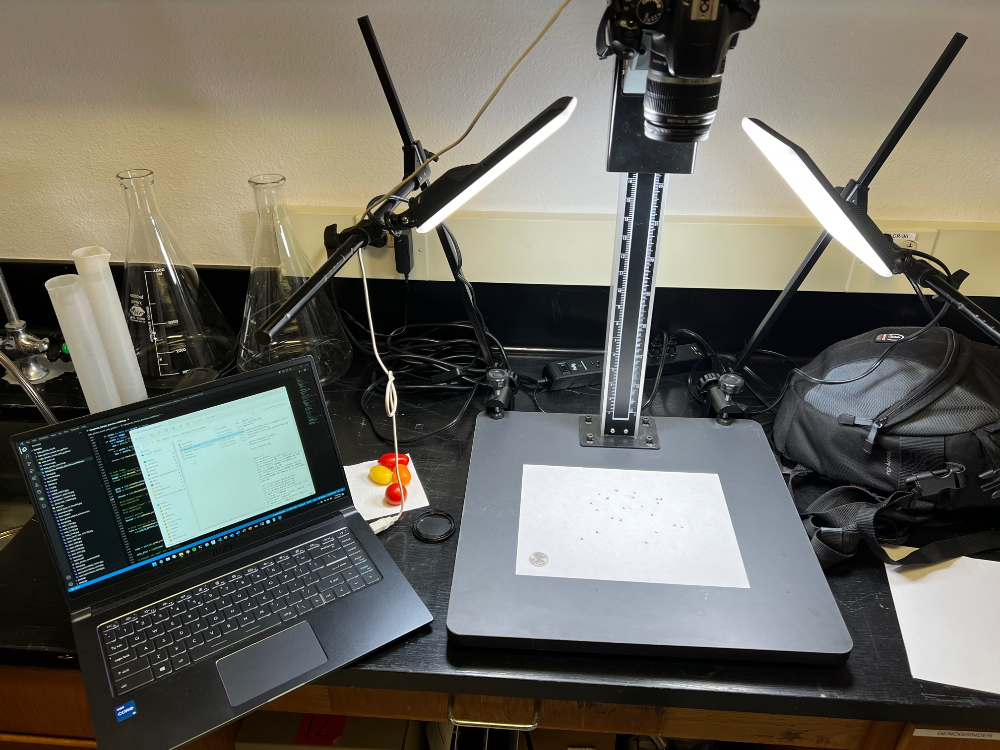

# seed_counter_pipeline_opencv
This is a collection of open source scripts and tools for using a camera to detect number of seeds on a sheet of paper. The tool uses a watershedding algorithm as to try to count seeds that are touching.    

## The setup
A camera mounted on top of a platform such that a 90 degree down angle (dont worry if it is perfect 90 degrees a four-point transformation fixes any deviations)

# Dependencies
- Windows operating system
- digiCamControl (open source digital DSLR controlling software)
- R with dependencies (ggplot2, ggpubr, knitr, gridExtra, magick)
- python with dependencies (imutils, skimage, cv2, numpy, scipy)

## The pipeline
- clone the repository
- open the seed_counter_pipeline folder
- double click the take_photo_count.bat

Details: the script will then connect to your DSLR, snap a photo, detect the 4 corners of the letter paper, then perform a four point transformation to correct from any deviation from 90 overhead and crop the photo. The script will then detect the new cropped photo, detect the aruco markers, get an average pixels per area of the 4 aruco markers, mask the aruco markers then count the objects. The resulting output will give you a R generated report looking like the below picture.

